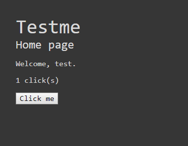

# Section 1 - Aperçu de l'application

Dans le cadre de ce dojo, on va directement expérimenter sur une application Django.

Elle est disponible dans le dossier `examples/web-app`.

C'est une application très pauvre fonctionnellement, on peut juste s'enregistrer/se connecter et incrémenter son compteur de clicks avec un bouton.

Le but premier de cette application est d'utiliser `pytest`.
